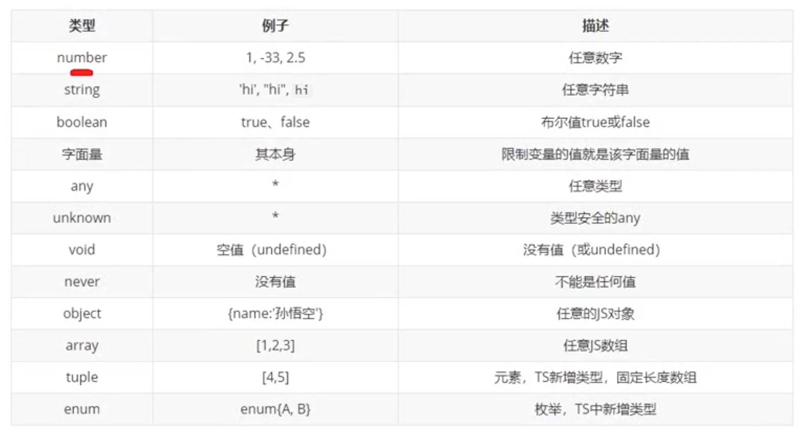

# Typescript 快速上手
## 参照
```aidl
https://www.cnblogs.com/joe235/p/13814753.html
```
## 安装
```shell
# node js
brew install nodejs
node -v 
# v15.1.0

# 全局安装
npm i -g typescript
tsc -v
# Version 3.1.6

# deno 执行器
curl -fsSL https://deno.land/x/install/install.sh | sh
export DENO_INSTALL="/Users/xxx/.deno"
export PATH="$DENO_INSTALL/bin:$PATH"
```

## Helloworld

```shell
mkdir hello
echo 'console.log("hello");' > helloworld.ts
tsc helloworld.ts
ls -l 
# hello
# 	|--helloworld.ts
# 	|--helloworld.js

node helloworld.js
# hello

ts-node helloworld.ts
# hello
```

## 类型

```shell
# 声明变量
let name:type

# 声明变量并赋值
let name:type = value

# 自动类型推断（赋值时类型就固定了）
let name = value

# 函数类型
function func(a:type):type;


```



